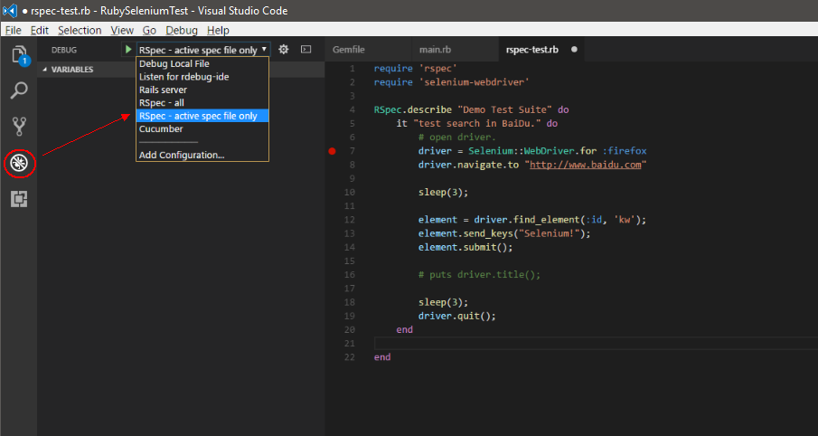

# Setup Environment(ruby for windows)

* [Setup environment step](#setup-environment-step)
* [Configure your DEV IDE（Use VS Code）](#configure-your-dev-ideuse-vs-code)
* [Download selenium driver](#configure-your-dev-ideuse-vs-code)
* [How to run and debug](#configure-your-dev-ideuse-vs-code)

## Setup environment step.
### Step 1 : Install ruby

You can downloads new verison for http://rubyinstaller.org/downloads/


### Step 2 : Install devkit

get the file [here](http://rubyinstaller.org/downloads/)

run the .exe file to unzip files into c:\DevKit

open your command line and type：
```code
> cd c:\DevKit
> ruby dk.rb init
> ruby dk.rb install --force
```

### Step 3 : Install bundler
open your command line and type：
```code
> gem install bundler
```

## Configure your DEV IDE（Use VS Code）
### Step 1 : Download & Install VS Code

You can downloads new verison for https://code.visualstudio.com/.

There are many extensions for Ruby.


### Step 2 : Install Ruby Extensions

Open your VS Code and click 'Extensions' button.

type 'ruby' in your search text box. install the first one.

> This extension provides rich Ruby language and debugging support for VS Code. you can get more information [here](https://github.com/rubyide/vscode-ruby)


## Download selenium driver
### Step 1 : Download selenium driver for firefox
Download selenium driver , link is : https://github.com/mozilla/geckodriver/releases.
Please check your selenium & firefox version.
> If you need to debug with another browser. Please download the appropriate driver.

There are docs APIs for selenium webdriver https://github.com/seleniumhq/selenium.

### Step 2 : Add the folder into your PATH environment.

Unzip the files and copy the execution file into a folder like c:\WebDriver;

Add the folder into your PATH environment.

## How to run & debug?

Now, Let's start your first auto demo for ruby + RSpec + selenium.

### Step 1 : Check the Environment

Create a folder like 'RubySeleniumTest' , and use VS Code navigate to this folder.

Open Terminal windows in VS Code( Ctrl + ~ ).

Check environment version : 

```code
> ruby -v
> gem -v
> bunlker -v
```
### Step 2 : Install Ruby Dependencies

If you are using JRuby or Ruby v1.8.x (jruby, ruby_18, mingw_18), run gem install ruby-debug-ide, the latest version is 0.6.0

If you are using Ruby v1.9.x (ruby_19, mingw_19), run gem install ruby-debug-ide, the latest version is 0.6.0. Make sure ruby-debug-base19x is installed together with ruby-debug-ide.

If you are using Ruby v2.x
```code
gem install ruby-debug-ide -v 0.6.0
gem install debase -v 0.2.2.beta10 or higher versions
```

Run this commond:
```code
bundle install --binstubs 
```

### Step 2 : Create project 
Initialize the project with the following command:
```code
bundle init
```
You will find the "Gemfile" when command completes. update "Gemfile" like:
```code
gem 'rspec'
gem 'selenium-webdriver'
gem 'selenium-client'
```

run commond:
```code
bundle init
```
### Step 3 : Run & Debug demo

create main.rb file, and write code like this:
```ruby
require 'rspec'
require 'selenium-webdriver'

# open driver.
driver = Selenium::WebDriver.for :firefox
driver.navigate.to "http://www.baidu.com"

sleep(3);

element = driver.find_element(:id, 'kw');
element.send_keys("Selenium!");
element.submit();

sleep(3);

driver.quit();
```

Enter F5 to run the ruby script. (Of course, you can use the command line ： ruby yourfile)
Now you can see the auto demo running, and you can add breakpoints to debug it.

### Step 4 : Run & Debug with RSpec

create rspec-test.rb file, and write code like this:
```ruby
require 'rspec'
require 'selenium-webdriver'

RSpec.describe "Demo Test Suite" do 
    it "test search in BaiDu." do 
        # open driver.
        driver = Selenium::WebDriver.for :firefox
        driver.navigate.to "http://www.baidu.com"

        sleep(3);
        
        element = driver.find_element(:id, 'kw');
        element.send_keys("Selenium!");
        element.submit();
        
        sleep(3);
        
        driver.quit();
    end 
end 
```

cilck "Debug" button, select 'RSpec - active spec file only' in dropdown list:


Enter F5 to run the ruby script like step 3.

Here are some useful links:
Selenium : https://github.com/SeleniumHQ/selenium

Rspec： 
	http://rspec.info/
	https://relishapp.com/rspec
	https://cucumber.io/

bundler : http://bundler.io/

gem : http://guides.rubygems.org/

Ruby test automation : https://github.com/atinfo/awesome-test-automation/blob/master/ruby-test-automation.md
